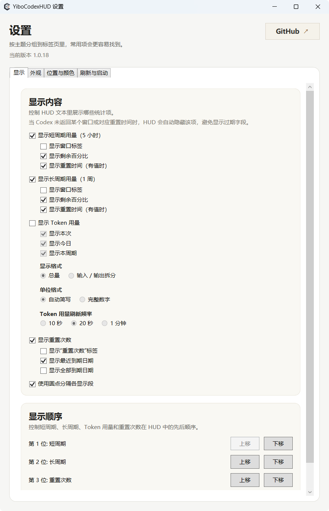

# YiboCodexHUD

中文 | [English](#english)

YiboCodexHUD 是一款面向 Codex / ChatGPT 桌面端的轻量 Windows 辅助工具。它将账户用量、重置时间和可用重置次数显示在应用标题栏附近，让你无需进入多层菜单即可查看状态。

它以外部悬浮层方式工作，不修改 Codex 或 ChatGPT 的安装文件。

## 截图

## English

YiboCodexHUD is a lightweight Windows companion for the Codex / ChatGPT desktop app. It shows account usage, reset time, and available reset credits near the app title bar, so you can check your status without opening several menus.

It runs as an external overlay and does not modify the Codex or ChatGPT installation.

## Screenshots

